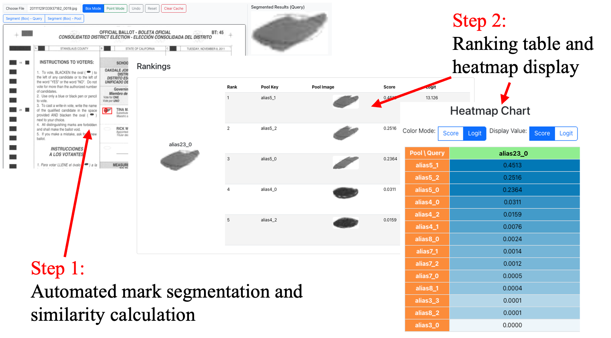
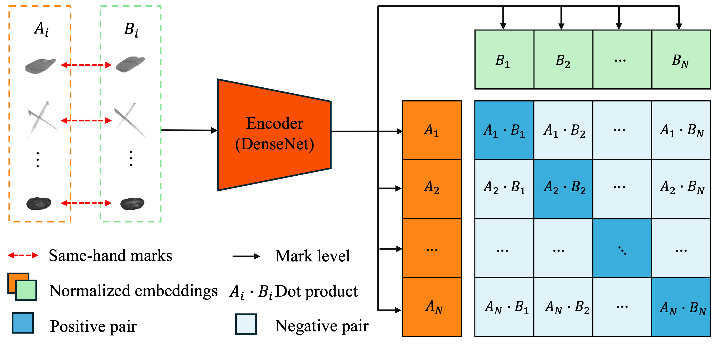

# 🗳️ BallotRetrieval (MarkMatch)

**BallotRetrieval (MarkMatch)** is an end-to-end **computer vision** and **contrastive retrieval learning** framework for same-hand ballot analysis and election integrity investigation. Given a ballot mark query, the framework learns discriminative **visual representations** through **contrastive learning** and retrieves stylistically similar ballot marks from a candidate pool, enabling scalable detection of potential same-hand ballot stuffing through **visual similarity analysis**.

## Overview

### BallotRetrieval Interface

*BallotRetrieval* interface. The system segments marks using prompt-based inputs (box or point), computes similarity between the query (green) and candidates (orange), and visualizes softmax-normalized scores via heatmap and ranking. To preserve privacy, marks are anonymized using letter-number aliases (e.g., `alias5_0`). In this example, three top-ranked matches from the same ballot (`alias5`) are retrieved for the query mark `alias23_0`, and manual review confirms both ballots were filled by the same individual.

<p align="center">
  
</p>

### Contrastive Learning Model

BallotRetrieval uses a contrastive learning framework with a DenseNet encoder to learn normalized embeddings for handwritten marks. Same-hand mark pairs are pulled together while non-matching pairs are pushed apart via dot-product similarity.

<p align="center">
  
</p>


## Introduction

The system allows users to:

* Upload and process scanned ballot images,
* Segment ballot marks using **SAM-based** prompt inputs (bounding boxes or points),
* Extract **visual embeddings** through a deep computer vision encoder,
* Retrieve and rank the most similar ballot marks using **contrastive retrieval learning**,
* Visualize similarity scores through **ranking tables and heatmaps**,
* Support transparent and scalable election auditing through **human-in-the-loop verification**.


To support flexible ballot mark extraction, we adapt and customize the **Segment Anything Model (SAM)** for **prompt-based ballot mark segmentation**. The customized SAM module enables efficient extraction of handwritten ballot marks from scanned ballots using simple **bounding-box or point prompts**, providing high-quality mark candidates for downstream **retrieval and similarity analysis**.

> **Note:** The trained model weights (`server/model_weight.h5`) are not included in this repository. Please contact <u>Fei Zhao</u> to request the weight file.

This repository accompanies our paper:

**MarkMatch: Same-Hand Stuffing Detection**  
*<u>Fei Zhao</u>, Runlin Zhang, Chengcui Zhang, Nitesh Saxena*  
Published in **IEEE International Conference on Multimedia & Expo (ICME) 2025**  
[IEEE Xplore](https://ieeexplore.ieee.org/abstract/document/11152127)


# Getting Started

## Prerequisites

Make sure you have **Node.js** and **npm** installed.

### Option 1
If you have Homebrew installed (this is what I did):
```bash
# install node
brew install node

# Check installation:
node -v
npm -v
```
### Option 2
- Download Node.js (includes npm): https://nodejs.org/
- Recommended version: Node.js LTS (e.g., 18.x or later)

To check if they are installed:

```bash
node -v
npm -v
```

### Note: To run the project, better start running backend then frontend

## Backend Setup
0. Open a new terminal
1. Create and Activate the virtual environment
```bash
# Insdie server/
cd demo/server

# On macOS/Linux:
python3 -m venv venv
source venv/bin/activate

# On Windows:
python -m venv venv
venv\Scripts\activate
```
2. Install dependencies
```bash
# Insider server/
pip install -r requirements.txt
```
3. Run app.py
```bash
python app.py
```

## Frontend Setup
0. Open a new terminal
1. Install dependencies
```bash
# Inside client/
# install dependencies
npm install
```
2. Run the web app
```bash
# Inside client/
npm start
```

## How to integrate model.py
1. The segmented images are saved to ```server/static/segmented_images/```
2. The output should be in exported to ```result.json```
    - The `result.json` format is structured as follows:
    ```json
    {
        "alias23_0": [
            {
                "Pool": "alias5_0",
                "Score": 0.5794,
                "Logit": 14.2857,
                "Query_path": "./static/Query/segmented_irregular/segmented_irregular_alias23_0.png",
                "Pool_path": "./static/Pool/segmented_irregular/segmented_irregular_alias5_0.png"
            },
            {
                "Pool": "...",
                "Score": 0.2162,
                "Logit": 13.3002,
                "Query_path": "...",
                "Pool_path": "..."
            }
            // additional candidates...
        ]
    }
    ```

    - Each key (e.g., `"alias23_0"`) represents a query image identifier.
    - Each value is a list of candidate pool images sorted by similarity `Score`.
    - Each item contains:
        - `Pool`: candidate image identifier.
        - `Score`: similarity score between the query and the candidate.
        - `Logit`: the raw logit value from the model.
        - `Query_path`: path to the query image.
        - `Pool_path`: path to the pool image.


## General Explanation on the project
### File stucture
1. This web app is built using a **React frontend** and a **Flask backend**.
    ### Frontend (React)

    The frontend, located in the `client` directory, provides a user-friendly interface that allows users to:

    - Upload images
    - Interact with the images (e.g., by clicking or selecting areas)
    - View segmentation results or combined outputs

    React communicates with the backend using HTTP requests (e.g., via `fetch` or `axios`). After receiving the processed data, it updates the UI to reflect the output in real-time.

    ### Backend (Flask + Python)

    The backend, found in the `/server` directory, exposes REST API endpoints to handle image processing. Its responsibilities include:

    - Receiving images or interaction data from the frontend
    - Running image segmentation or annotation models (e.g., using PyTorch or TensorFlow)
    - Returning the processed results (such as segmentation masks, predictions, or combined images)

    ### Communication Flow

    1. The user uploads an image or interacts with the interface in the frontend.
    2. The frontend sends this data to the backend via an HTTP request.
    3. The backend processes the data using a pre-trained model.
    4. The backend sends the result (often as JSON or base64-encoded image) back to the frontend.
    5. The frontend renders the result for the user to view or interact with further.

2. All frontend are inside client/
    - Combine Images page: CombineImages.js
    - Image Annotation page: ImageAnnotation.js
    - View Segmented Images page: SegmentedImages.js
    - Results page: Results.js
    - App.js: Top-level component, defines routing and layout
3. All backend are inside server/
    - `app.py`: main file that controls all APIs
    - `segment_anything.py`: Meta Segment Anything that segments the images based on user's drawn boxes, export the segmented images to server/static/segmented_images
    - `model.py`: file for the model Same-Hand-Ballot, awaiting implementation. Right now the file exports dummy result.json for the web app to show the Results Page.
    - `server\venv`: the virtual environment to run segment_anything.py and model.py
    - `input_data.json`: contains the locations of boxes, and the image name, used for segment_anything.py
        - it also contains the combined_image path if existed, ImageAnnotation.js will use this to determin if the button 'Use Combined' should be disabled or not
    - `result.json`: contains the results to display on Results page
### Page Functionalities
1. Combine Images Page: 
    - Allows users to upload 2 images, and when the button '**Combine Images**' is clicked, the combined image will be generated, the user can determine if they want to export the image by clicking the button '**Export Image**'
    - The exported image will be saved to `server/uploads`
2. Annotate Image Page:
    - Allows users to upload an image to annotate. Or, if there is a combined image just produced (combined image file name is in input_data.json and there is such an image in the `server/uploads` folder), the '**Use Combined Image**' button will be enabled to automatically upload the combined image; otherwise the button is disabled.
    - Users can draw boxes with their mouse on the uploaded image to show the area of interest for segmentation. Users can click the button '**Undo Last Box**' to under the last drawn box.
    - After users finished drawing the boxes, user can click the button '**Segment!**' to trigger the segment_anything.py to run to segment the image, and it will automatically jump to view segmented images page after finish running
        - **Warning**: if the view segmented images page isn't showing all the segmented images, refresh the page
    - User can click the '**Remove Cache**' button to remove all results in result.json, input_data.json, remove all segmented images in `server/static/segmented_images`, and remove all uploaded images in `server/uploads`.
        - **Warning**: if the cache is not removed, it can have more than wanted segmented images in the storage, causing the view segmented image to return extra images
3. View Segmented Image page:
    - if the view segmented images page isn't showing all the segmented images, refresh the page
    - the page will show all the segmented images under server/static/segmented_images, user can click '**Calculate Similarity**' to trigger the model.py to generate result to result.json, eventually jumping to results page
4. Results page:
    - this page reads the results from reuslt.json and display them

<!-- ## Demos
1. Annotate Uploaded Image
[[Watch the demo]](https://youtu.be/AFoibjyXcJY)
2. Annotate Combined Image
[[Watch the demo]](https://youtu.be/mHSrs_L0WWo)
3. Remove Cache Effets
[[Watch the demo]](https://youtu.be/J2fIXk0XuUk) -->


## Trouboushooting
On the web app, right click, go to Inspect -> Network

If see error similar to this
```
Access to fetch at 'http://localhost:5000/api/export-combined' from origin 'http://localhost:3000' has been blocked by CORS policy: Response to preflight request doesn't pass access control check: No 'Access-Control-Allow-Origin' header is present on the requested resource. If an opaque response serves your needs, set the request's mode to 'no-cors' to fetch the resource with CORS disabled.
```

1. Try restart the app.py and the web app by re running `python app.py` and `npm start` in the respective terminal
2. Open a new terminal
    ```bash
    # try pull the api and see the response
    curl -i -X OPTIONS http://localhost:5000/api/export-combined
    ```
    If output response is success (status code 200), restart app.py and the web app. It should work, there is no problem.

    If output is something like this
    ```bash
    HTTP/1.1 403 Forbidden
    Content-Length: 0
    Server: AirTunes/845.5.1 # this means port 5000 on localhost is being occupied by another process
    X-Apple-ProcessingTime: 0
    X-Apple-RequestReceivedTimestamp: 646419282
    ```
    Change the port number to another (like 6000/8000/8200...) in app.py
    ```python
    if __name__ == '__main__':
        app.run(debug=True, host='localhost', port=8000) # change the port number here
    ```
    Change the port number to the new one for all front end by going to `CombineImages.js`,` ImageAnnotation.js`, `SegmentedImages.js` and `Results.js`,
    replace all "localhost:{old port number}" to "localhost:{new port number}"

    
## Some Notes
### segment_anything.py
Warning: only works with transformers==4.47.1, transformers-4.51.0 is too advanced and it will cause NameError: name 'init_empty_weights' is not defined when running segment_anything.py


### Acknowledgement
This work was supported by NSF CNS-2154589 and 2154507, “Collaborative Research: SaTC: CORE: Medium: Bubble Aid: Assistive AI to Improve the Robustness and Security of Reading HandMarked Ballots,” $1,200,000, 10/01/2022-09/30/2026.

If you find this work helpful, please consider citing:
```bibtex
@INPROCEEDINGS{11152127,
  author={Zhao, Fei and Zhang, Runlin and Zhang, Chengcui and Saxena, Nitesh},
  booktitle={2025 IEEE International Conference on Multimedia and Expo (ICME)}, 
  title={MarkMatch: Same-Hand Stuffing Detection}, 
  year={2025},
  volume={},
  number={},
  pages={1-2},
  keywords={Deep learning;Visualization;Noise;Contrastive learning;Ballot Stuffing Detection;Deep Learning},
  doi={10.1109/ICMEW68306.2025.11152127}}
```


